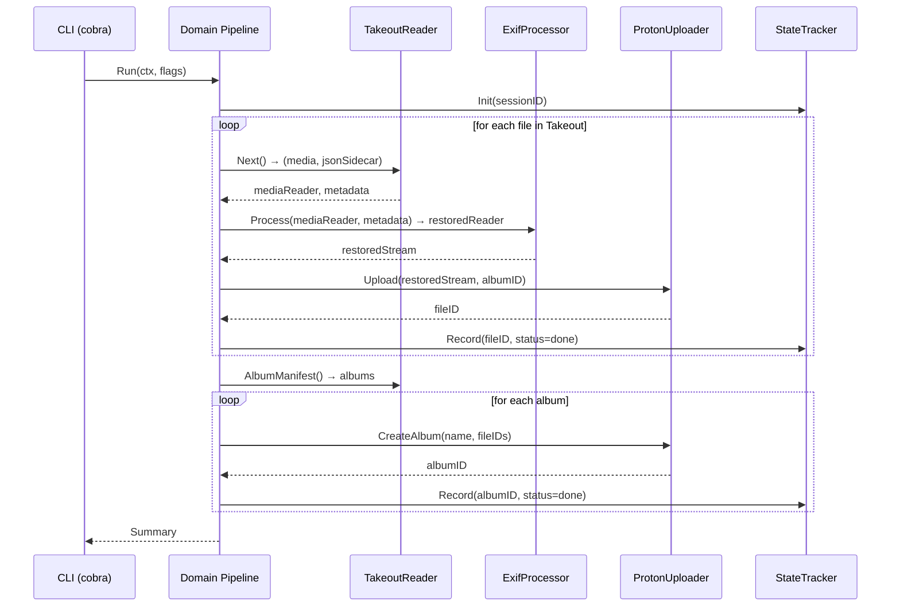

# Architecture Spine — gphoto2proton

## Design Paradigm

**Hexagonal Architecture** (ports and adapters). The core domain logic — migration pipeline, photo/album entities, state machine — has zero external dependencies. All side effects (filesystem I/O, Proton API calls, exiftool subprocesses, SQLite persistence) are behind interface boundaries (`port`s) with concrete `adapter`s injected at the composition root (`cmd/gphoto2proton/main.go`).

The pipeline itself follows a **linear streaming chain** within the domain — it is not an independent paradigm but a concrete orchestration pattern inside the hexagon:

```
Takeout tar stream → [Parse JSON sidecar] → [Apply EXIF via exiftool] → [Upload to Proton Drive]
                                          → [Record state in SQLite]
                                          → [After all files: recreate albums]
```

```
flowchart TD
    CLI["CLI (cobra)"] --> Compose["Composition Root"]
    Compose --> Pipeline["Domain: Pipeline"]
    Pipeline --> TakeoutPort["Port: TakeoutReader"]
    Pipeline --> ExifPort["Port: ExifProcessor"]
    Pipeline --> UploadPort["Port: ProtonUploader"]
    Pipeline --> StatePort["Port: StateTracker"]
    TakeoutPort --> TakeoutAdapter["Adapter: tar-fs streaming"]
    ExifPort --> ExifAdapter["Adapter: exiftool subprocess"]
    UploadPort --> UploadAdapter["Adapter: Proton-API-Bridge"]
    StatePort --> StateAdapter["Adapter: modernc/sqlite"]

    style Pipeline fill:#f3e5f5
    style TakeoutPort fill:#fff3e0
    style ExifPort fill:#fff3e0
    style UploadPort fill:#fff3e0
    style StatePort fill:#fff3e0
    style TakeoutAdapter fill:#e8f5e9
    style ExifAdapter fill:#e8f5e9
    style UploadAdapter fill:#e8f5e9
    style StateAdapter fill:#e8f5e9
```

## Invariants & Rules

### AD-1 — Language: Go

- **Binds:** all
- **Prevents:** polyglot fracture, runtime dependency chains
- **Rule:** Every line of production code is Go. Build scripts, CI config, and docs are the only exceptions.

### AD-2 — Architecture: Hexagonal

- **Binds:** all
- **Prevents:** business logic coupled to Proton API types, exiftool output formats, or SQLite schemas
- **Rule:** Domain packages import only Go stdlib + domain-internal packages. Adapter packages import their port interface + external libraries. CLI/composition root imports everything.

### AD-3 — CLI Framework: cobra

- **Binds:** `cmd/`, CLI UX
- **Prevents:** ad-hoc flag parsing, inconsistent subcommand patterns
- **Rule:** Every execution path starts from a cobra `Command` in `cmd/gphoto2proton/`. No `os.Args` parsing outside cobra.

### AD-4 — State Storage: modernc.org/sqlite

- **Binds:** `internal/state/`
- **Prevents:** CGO cross-compile failures, heavyweight DB dependencies
- **Rule:** SQLite is the only persistence layer. Schema is managed via Go migration functions (one per version), never raw SQL files.

### AD-5 — Proton Integration: go-proton-api + rclone/Proton-API-Bridge

- **Binds:** `internal/proton/`
- **Prevents:** re-implementing Proton's cryptographic key handling and block verification
- **Rule:** Authentication flows through `go-proton-api`. File upload/download/listing goes through `Proton-API-Bridge`. Album recreation (Proton Photos) is custom code wrapped in the same adapter — reverse-engineered from Proton web client traffic.

### AD-6 — EXIF: exec exiftool

- **Binds:** `internal/exif/`
- **Prevents:** incomplete metadata handling from pure-Go EXIF libraries
- **Rule:** `exiftool` MUST be a documented system dependency. The adapter shells out via `os/exec`. On failure, log warning and proceed with unmodified file (best-effort).

### AD-7 — License: MIT

- **Binds:** repository, all source files
- **Prevents:** license friction for downstream adopters and contributors
- **Rule:** Every source file carries the MIT license header. The LICENSE file at the repo root is the canonical reference.

### AD-8 — Dependency Direction

- **Binds:** all packages
- **Prevents:** circular imports, adapter-to-adapter coupling
- **Rule:** `domain` ← `ports` ← `adapters`. No adapter imports another adapter. The composition root (`cmd/gphoto2proton/`) is the only place that imports both ports and adapters.

### AD-9 — State Machine per Migration

- **Binds:** `internal/domain`
- **Prevents:** duplicate uploads, inconsistent resume, lost progress on crash
- **Rule:** Each migration run creates a SQLite row per file with states: `pending → processing → uploaded → album_attached → done`. Any state may transition to `failed` on error. Resume semantics: `done` (skip), `failed` (full retry), `pending` (process as new), `processing` (re-upload, discard partial upload), `uploaded` (re-check and continue), `album_attached` (re-check album and continue).

### AD-10 — Album Recreation Protocol

- **Binds:** `internal/domain`, `internal/proton/`, `internal/takeout/`
- **Prevents:** ambiguous ownership of album→fileID mapping, two divergent implementations
- **Rule:** The pipeline owns album→fileID accumulation. The `TakeoutReader` port exposes `AlbumManifest() -> []domain.Album` for post-upload bulk processing. The `ProtonUploader` port exposes `CreateAlbum(name, fileIDs)`. No per-file inline album tagging.

### AD-11 — Port Interfaces Reference Domain Types

- **Binds:** `internal/port/`
- **Prevents:** port-local entity structs that diverge from domain types
- **Rule:** All port interface method signatures reference types from `internal/domain/` (e.g., `domain.Photo`, `domain.Album`). Adapters map external formats to/from domain types. Port packages never define their own entity structs.

## Consistency Conventions

| Concern | Convention |
|---|---|
| Naming | `camelCase` for Go unexported, `PascalCase` for exported. Files match the main type they contain. Test files: `*_test.go` alongside source. |
| Errors | Domain errors are typed sentinels (`var ErrNotFound = errors.New("...")`). Adapter errors wrap with `fmt.Errorf("adapter: %w", err)`. |
| Logging | Structured via `log/slog` (Go 1.21+). Levels: `DEBUG` (per-file progress), `INFO` (phase changes), `WARN` (exiftool failures), `ERROR` (fatal). |
| Configuration | CLI flags + env var fallback via cobra/viper. No config files in v1. |
| Data formats | JSON sidecar parsing uses `encoding/json` with explicit structs (no `map[string]any`). |

## Stack

| Name | Version | Purpose |
|---|---|---|
| Go | 1.23+ | Language & toolchain |
| cobra | latest | CLI framework |
| modernc.org/sqlite | latest | State persistence |
| go-proton-api | v0.4+ | Proton auth & low-level API |
| rclone/Proton-API-Bridge | v1.0+ | Proton file ops (upload/download/list) |
| exiftool | system pkg | EXIF metadata restoration |

## Structural Seed

### Source Tree

```
gphoto2proton/
  cmd/
    gphoto2proton/
      main.go              # Composition root — wire everything
  internal/
    domain/                # Core entities, pipeline, state machine
      photo.go
      album.go
      migration.go         # Migration session + state machine
      pipeline.go          # Orchestrator: reader→processor→uploader
    port/                  # Interface boundaries
      takeout.go           # TakeoutReader port
      exif.go              # ExifProcessor port
      upload.go            # ProtonUploader port
      state.go             # StateTracker port
    takeout/               # Adapter: streaming tar/tgz reader
      stream.go            # tar-fs reader implementing TakeoutReader
      metadata.go          # JSON sidecar parser
    exif/                  # Adapter: exiftool subprocess
      processor.go         # Implements ExifProcessor
    proton/                # Adapter: Proton Drive + Photos
      auth.go              # go-proton-api auth flow
      upload.go            # Proton-API-Bridge upload
      album.go             # Custom album recreation (Proton Photos)
    state/                 # Adapter: SQLite state tracker
      sqlite.go            # Implements StateTracker
      migrations.go        # Schema migrations
```

### Streaming Pipeline Flow



## Deferred

- **Album recreation in Proton Photos:** The Proton Photos album API is undocumented. Deferred to a dedicated reverse-engineering spike after the core pipeline works. The adapter interface (`ProtonUploader`) includes `CreateAlbum` already — it can be a no-op in v0.1.
- **Incremental sync:** v1 is one-shot migration from Takeout. Incremental sync (detecting new photos since last export) requires Google Photos API access, which is restricted. Postpone until Google's API stance is clearer.
- **Windows support:** Out of scope per brief. Easy to add later via Go's cross-compilation if demand appears.
- **TUI / GUI:** CLI-only for v1. Cobra's help system is the interface.
- **CI/CD pipeline:** Not pinned yet. GitHub Actions with `goreleaser` is the convention but not binding.
