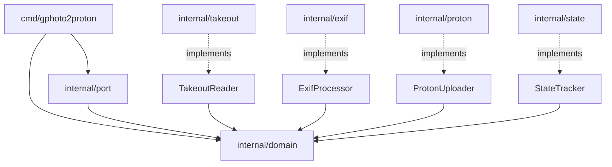

# Architecture

gphoto2proton follows the **hexagonal (ports & adapters)** architecture pattern.

---

## Package Layout

```
cmd/gphoto2proton/         CLI entry point (Cobra)
├── main.go                func main() calls Execute()
├── root.go                CLI commands, flags, Execute()
├── pipeline.go            Pipeline orchestration
├── root_test.go           CLI tests
└── pipeline_test.go       Pipeline tests (mocks)

internal/                  Not importable outside this module
├── domain/                Core business types
│   ├── photo.go           Media, MediaMeta structs
│   ├── album.go           Album struct, AlbumHandler callback
│   └── migration.go       State enum (Pending → AlbumAttached)
├── port/                  Interface definitions (the "ports")
│   ├── takeout.go         TakeoutReader interface
│   ├── exif.go            ExifProcessor interface
│   ├── upload.go          ProtonUploader interface
│   └── state.go           StateTracker interface
├── takeout/               Adapter: Google Takeout streaming
│   ├── stream.go          tar/tgz streaming reader
│   └── metadata.go        JSON sidecar + album parsing
├── exif/                  Adapter: EXIF restoration
│   └── processor.go       exiftool subprocess wrapper
├── proton/                Adapter: Proton integration
│   ├── auth.go            CredentialStore (save/load/clear)
│   ├── upload.go          Proton-API-Bridge uploader
│   └── album.go           Proton Photos HTTP album client
└── state/                 Adapter: persistence
    └── sqlite.go          SQLite state tracker
```

---

## Dependency Flow



Each adapter implements a `port` interface with zero knowledge of the CLI layer.
The pipeline in `cmd/gphoto2proton` wires concrete adapters into the interfaces.

---

## Pipeline Orchestration

The `Pipeline` struct in `cmd/gphoto2proton/pipeline.go` coordinates the full
migration:

```
Pipeline.Run()
├── uploadAll()
│   └── loop: Reader.Next() → Exif.Process() → Uploader.Upload() → State.RecordFull()
├── Reader.AlbumManifest()
├── recordAlbumMembership()   → State.RecordAlbumMembership() per album/file
└── createAlbums()
    └── loop: Uploader.CreateAlbum()
```

Source: `cmd/gphoto2proton/pipeline.go:45`

```go
type Pipeline struct {
    Reader   port.TakeoutReader
    Uploader port.ProtonUploader
    State    port.StateTracker
    Exif     port.ExifProcessor
    OnAlbums domain.AlbumHandler
    Logger   *slog.Logger
    Resume   bool
}
```

---

## Port Interfaces

All interfaces are defined in `internal/port/`:

### TakeoutReader

```go
type TakeoutReader interface {
    Next(ctx context.Context) (*domain.Media, io.ReadCloser, error)
    AlbumManifest(ctx context.Context) ([]domain.Album, error)
}
```

### ExifProcessor

```go
type ExifProcessor interface {
    Process(ctx context.Context, r io.Reader, meta *domain.MediaMeta) (io.ReadCloser, error)
}
```

### ProtonUploader

```go
type ProtonUploader interface {
    Upload(ctx context.Context, name string, r io.Reader) (string, error)
    CreateAlbum(ctx context.Context, name string, fileIDs []string) (string, error)
}
```

### StateTracker

```go
type StateTracker interface {
    Init(ctx context.Context, sessionID string) error
    Record(ctx context.Context, fileID string, state domain.State) error
    RecordFull(ctx context.Context, fileID string, state domain.State, fileName string, fileSize int64, errorMsg string) error
    RecordAlbum(ctx context.Context, albumID string, state domain.State) error
    RecordAlbumMembership(ctx context.Context, albumName, fileName string) error
    AccumulatedAlbums(ctx context.Context) ([]domain.Album, error)
    FileStates(ctx context.Context, sessionID string) ([]FileEntry, error)
    Close() error
}
```

---

## Testing Strategy

Each adapter is tested independently with mocked dependencies:

| Package | Test File | Approach |
|---------|-----------|----------|
| `takeout` | `takeout_test.go`, `metadata_test.go` | Real tar/tgz fixtures |
| `exif` | `exif_test.go` | With/without exiftool on PATH |
| `proton` | `proton_test.go`, `album_test.go` | Mock HTTP servers |
| `state` | `state_test.go` | In-memory SQLite |
| `cmd/gphoto2proton` | `root_test.go`, `pipeline_test.go` | Mock readers/uploaders |

All 126 tests pass on `main`. Run them with:

```bash
go test -v -race -coverprofile=coverage.out ./...
```
