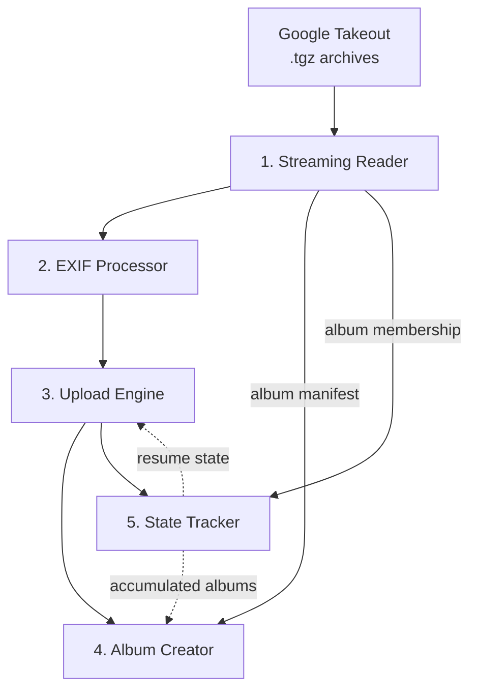
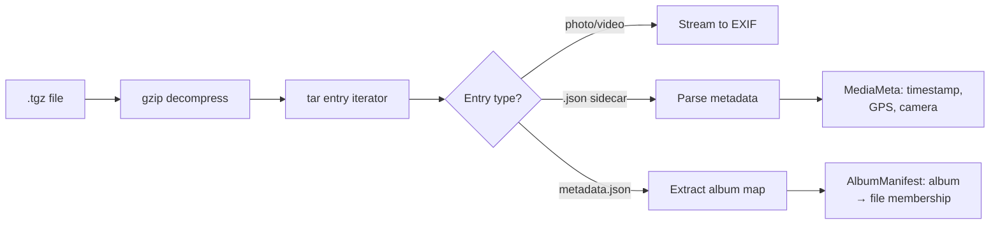
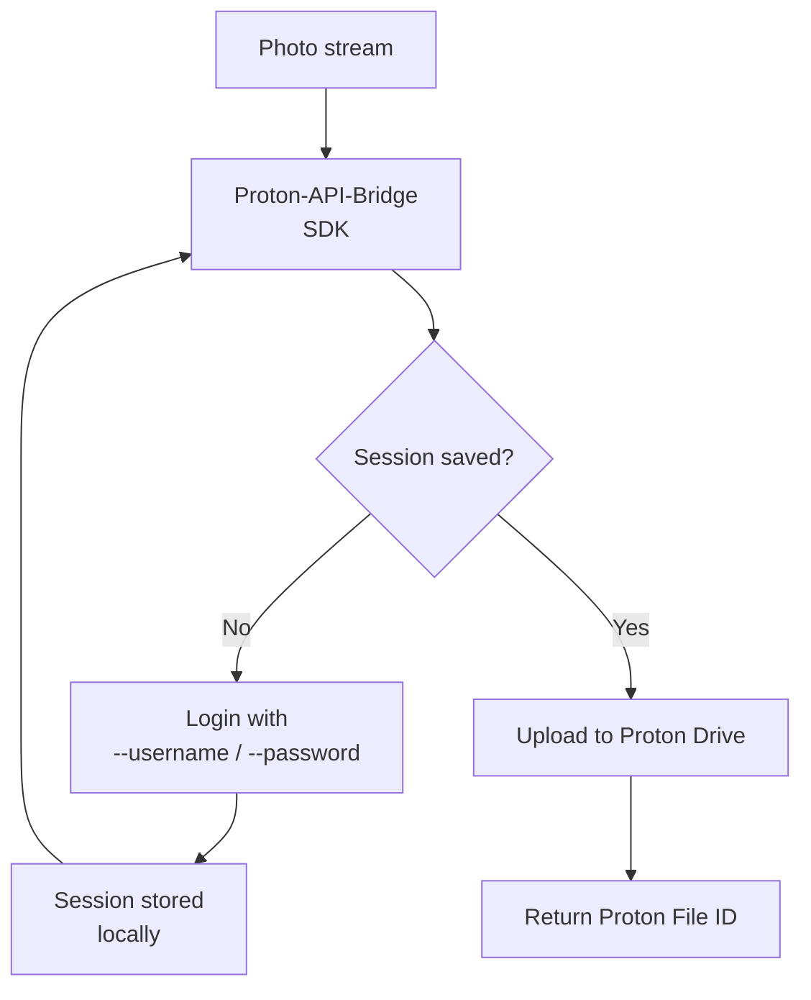

# How It Works

The migration pipeline processes Google Takeout archives through five stages:

---

## 1. Streaming Reader

Two input modes are supported, both implementing the same streaming interface:

| Mode | Flag | Behaviour |
|------|------|-----------|
| Archive (recommended) | `--takeout-archive <file.tgz>` | Reads a `.tgz`/`.tar.gz` directly, entry-by-entry — **no extraction, no extra disk space** |
| Directory | `--takeout-dir <dir>` | Walks an already-extracted `Takeout/` directory |

Instead of extracting gigabytes to disk, the archive reader decompresses the
gzip stream and iterates tar entries in memory:

The reader also extracts album manifests from Google's `metadata.json` and the
per-photo sidecars, mapping which photos belong to which albums. When you
process multiple archives in separate `sync` runs, this membership is recorded
to the SQLite state database after each run, so **albums that span multiple
archives are accumulated** and finally recreated by `gphoto2proton
albums-finalize`.

---

## 2. EXIF Processor

Google Takeout stores metadata in `.json` sidecar files alongside each photo,
but the actual image files often lack proper EXIF data. This stage writes the
metadata back into the image.

For each media file, the processor:

1. Reads the JSON sidecar for `photoTakenTime`, `geoData`, and camera info
2. Constructs an `exiftool` command with the correct arguments
3. Pipes the raw image through `exiftool` — output is a new image with EXIF
   tags embedded

**Tags restored:**

| EXIF Tag | Source |
|----------|--------|
| `DateTimeOriginal` | JSON `photoTakenTime.timestamp` |
| `GPSLatitude` / `GPSLongitude` | JSON `geoData.latitude` / `.longitude` |
| `GPSAltitude` | JSON `geoData.altitude` |
| `Make` / `Model` | JSON camera metadata |
| `ImageDescription` | JSON description |
| `FileModifyDate` | Capture timestamp |

If `exiftool` is not installed, the stage is skipped with a warning.

---

## 3. Upload Engine

Uploads photos to Proton Drive using the Proton-API-Bridge SDK.

The uploader:

- Authenticates directly with the Proton API (SRP login) — no OAuth2, no
  browser, fully headless
- Alternatively reuses an existing session imported from the proton-drive CLI
  via `gphoto2proton import-session` — no password or CAPTCHA needed
- Detects MIME type from file extension
- Streams the photo data directly — no temp file on disk
- Saves the authenticated session for reuse on later runs
- Maps local filenames to Proton file IDs for album creation

See [Authentication](authentication.md) for the full login story.

**Supported formats:**

| Extension | MIME Type |
|-----------|-----------|
| `.jpg` / `.jpeg` | `image/jpeg` |
| `.png` | `image/png` |
| `.heic` | `image/heic` |
| `.mov` | `video/quicktime` |
| `.mp4` | `video/mp4` |
| `.cr2` | `image/x-canon-cr2` |
| `.nef` | `image/x-nikon-nef` |
| `.arw` | `image/x-sony-arw` |

---

## 4. Album Creator

Albums are created from the album manifest of the current input. When you
process several archives across multiple `sync` runs, album membership is also
persisted to the state database after every run; the `gphoto2proton
albums-finalize` command then recreates the accumulated, cross-archive albums in
one pass.

For each album:

1. Looks up the Proton file ID for each photo in the album
2. Creates the album via the Proton Photos HTTP API
3. Adds the photos to the album
4. Records the album state in the SQLite tracker

---

## 5. State Tracker

A SQLite database (pure Go, no CGo) tracks every file's migration state:

- **Pending** — Not yet processed
- **Processing** — Currently uploading
- **Uploaded** — Successfully uploaded
- **Failed** — Upload error occurred
- **Skipped** — Skipped (resume mode, already uploaded)

It also keeps an `album_members` table that accumulates album membership across
archive runs. On resume, the tracker identifies completed files (skipped) and
failed files (retried), ensuring the migration picks up exactly where it left
off without re-uploading anything.

---

## Error Handling

The pipeline is designed for resilience:

- **Per-file errors** — A failed upload does not stop the entire migration
- **Album creation errors** — Failed albums are logged and skipped, migration
  continues
- **State persistence** — Every success is recorded immediately
- **Resume** — Interrupted runs restart from the last checkpoint
