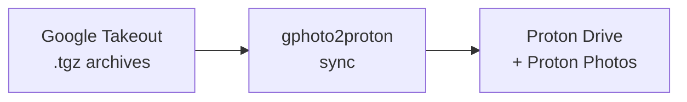

# gphoto2proton

**Google Photos Takeout → Proton Drive, in a single command.**

Move your photo library out of Google Photos and into your Proton ecosystem —
with streaming, EXIF restoration, album recreation, and resume safety.

---

## Key Features

| | Feature | Benefit |
|---|---|---|
| ⚡ | **Streaming** | Processes archives entry-by-entry — no full extraction needed |
| 📸 | **EXIF Restoration** | Writes back DateTimeOriginal, GPS, and camera metadata |
| 🖼️ | **Album Recreation** | Rebuilds Google Photos albums inside Proton Photos |
| 🔁 | **Resume Safety** | SQLite state tracker — interrupt and resume without re-uploading |
| 🔒 | **On-Device** | Authenticates via Proton SDK; credentials never leave your machine |

---

## Quick Links

- [Installation](installation.md) — Install via Homebrew, source, or pre-built binary
- [Quick Start](quickstart.md) — Get running in 2 minutes
- [Commands](commands.md) — Full CLI reference
- [Authentication](authentication.md) — Headless login, sessions, and 2FA notes
- [How It Works](how-it-works.md) — Pipeline internals explained
- [Architecture](architecture.md) — Hexagonal architecture deep dive
- [Troubleshooting](troubleshooting.md) — Common issues and fixes
- [FAQ](faq.md) — Frequently asked questions

---

## License

MIT — see [LICENSE](https://github.com/mmornati/gphoto2proton/blob/main/LICENSE).
