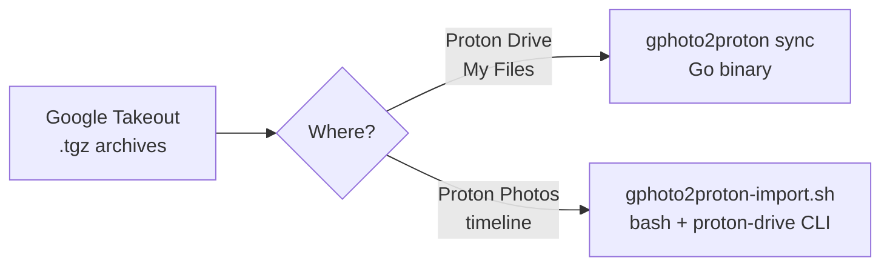

# gphoto2proton

**Google Photos Takeout → Proton, in a single command.** Choose where your
photos end up:

Move your photo library out of Google Photos and into your Proton ecosystem —
with streaming, EXIF restoration, album recreation, resume safety, and RAW
(NEF/CR2/ARW) support.

---

## Choose your workflow

| | **Proton Drive (My Files)** | **Proton Photos (timeline)** |
|---|---|---|
| **Tool** | [`gphoto2proton sync`](quickstart.md) — Go binary | [`gphoto2proton-import.sh`](scripts/quickstart.md) — bash script |
| **Albums** | Legacy Photos API | Native Photos albums |
| **EXIF** | Restored via exiftool | Read natively by the CLI |
| **RAW (NEF/CR2/ARW)** | Not handled | ✅ Converted to JPEG |
| **Disk** | Streaming, no extraction | Extracts one archive at a time |
| **Platform** | macOS, Linux, Windows | Linux |
| **Auth** | Proton API credentials | `proton-drive` session in `pass` |
| **More** | [Go Quick Start](quickstart.md) · [Commands](commands.md) | [Scripts Overview](scripts/overview.md) · [Scripts Quick Start](scripts/quickstart.md) · [Import Reference](scripts/import.md) |

!!! tip "Not sure?"
    See [Scripts / Proton Drive CLI → Overview](scripts/overview.md) for a
    detailed comparison and a guided decision. The two approaches are not
    mutually exclusive — they write to different places in Proton.

---

## Key Features

| | Feature | Benefit |
|---|---|---|
| ⚡ | **Streaming** | Go binary processes archives entry-by-entry — no full extraction needed |
| 📸 | **EXIF Restoration** | Writes back DateTimeOriginal, GPS, and camera metadata |
| 🖼️ | **Album Recreation** | Rebuilds Google Photos albums inside Proton Photos |
| 🔁 | **Resume Safety** | SQLite state (Go) and per-archive progress files (bash) — interrupt and resume without re-uploading |
| 🔑 | **proton-drive CLI reuse** | Both workflows can reuse an existing proton-drive CLI session — no password or CAPTCHA needed |
| 🖼️ | **RAW support** | Bash script converts NEF/CR2/ARW to JPEG and can recover previously skipped files |

---

## Quick Links

- [Installation](installation.md) — Install via Homebrew, source, or pre-built binary
- [Quick Start](quickstart.md) — Go binary workflow in 2 minutes
- [Scripts Quick Start](scripts/quickstart.md) — Bash import workflow in 2 minutes
- [Commands](commands.md) — Full CLI reference
- [Scripts Reference](scripts/import.md) — `gphoto2proton-import.sh` flags, env vars, pipeline
- [Authentication](authentication.md) — Headless login, sessions, and 2FA support
- [How It Works](how-it-works.md) — Pipeline internals explained
- [Architecture](architecture.md) — Hexagonal architecture deep dive
- [Troubleshooting](troubleshooting.md) — Common issues and fixes
- [FAQ](faq.md) — Frequently asked questions

---

## License

MIT — see [LICENSE](https://github.com/mmornati/gphoto2proton/blob/main/LICENSE).
