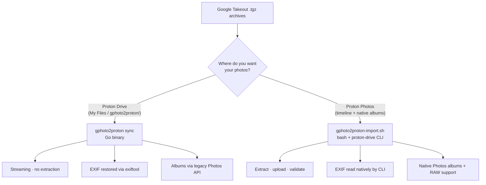

# Scripts / Proton Drive CLI — Overview

gphoto2proton offers **two import workflows**, and which one you pick depends
entirely on **where you want your photos to end up**:

1. **Proton Drive (My Files)** — the Go binary (`gphoto2proton sync`)
2. **Proton Photos timeline** — the bash scripts (`gphoto2proton-import.sh`)

---

## Which workflow should I choose?

| | **Go binary** (`gphoto2proton sync`) | **Bash scripts** (`gphoto2proton-import.sh`) |
|---|---|---|
| **Target** | Proton Drive — My Files / gphoto2proton/ | Proton Photos timeline |
| **Albums** | Recreated via legacy Photos API | Recreated natively (photos-volume) |
| **EXIF** | Restored from takeout JSON sidecar (exiftool) | Read natively from files by the CLI |
| **RAW support** (NEF/CR2/ARW) | ❌ Not handled | ✅ Converted to JPEG (`--convert-raw`) |
| **Disk** | Streaming — no extraction | Extracts one archive at a time (≈ 2× archive size) |
| **Platform** | macOS, Linux, Windows | Linux (where `proton-drive` CLI runs) |
| **Auth** | Proton API (password / 2FA or session import) | `proton-drive auth login` session in `pass` |
| **Best for** | Local / laptop use, low disk footprint | Server-based bulk import into Proton Photos |

### Choose the **Go binary** if...

- You want your photos stored under **Proton Drive My Files**, not the Photos
  timeline.
- You want to run on **macOS or Windows**, not just Linux.
- Your **disk space is limited** — it streams from `.tgz` and never extracts.
- You're okay running **`albums-finalize`** afterwards to recreate albums.

### Choose the **bash scripts** if...

- You want your photos **directly in the Proton Photos timeline**, where they
  behave like photos taken on your phone (searchable, in your photo app, with
  native albums).
- You have a **Linux server** with the
  [proton-drive CLI](https://github.com/ProtonDriveApps/sdk) installed.
- Your library contains **camera RAW files** (NEF/CR2/ARW) you want imported.
- You're migrating a **large archive set** (hundreds of GB) and can afford
  per-archive extraction.

!!! tip
    The two approaches are **not mutually exclusive**. You can use the bash
    script as the primary import path and keep the Go binary for one-off
    archives, or vice-versa. They write to different places in Proton.

---

## The bash scripts at a glance

| Script | Purpose |
|---|---|---|
| [`gphoto2proton-import.sh`](import.md) | Full import pipeline: extract → upload → verify → albums → validate → cleanup. Resumable per step, supports RAW conversion and recovery reprocessing. |
| [`gphoto2-album-check.sh`](album-check.md) | Compare album membership between Google Takeout and Proton Photos — read-only audit. |
| [`gphoto2-album-repair.sh`](album-repair.md) | Repair album membership: add missing photos to existing albums, create missing albums and populate them based on Takeout log data. Supports `--dry-run` preview. |
| [`fix-photo-date.sh`](fix-photo-date.md) | Fix the capture time of already-uploaded Proton Photos (typically videos that got the archive extraction date instead of the recording date). |
| [`detect-album-conflicts.sh`](detect-album-conflicts.md) | Scan all albums for photos with wrong capture times — outputs a TSV ready for `fix-photo-date.sh`. |
| [`detect-google-conflicts.sh`](detect-google-conflicts.md) | Find ALL Google-sourced photos whose Proton capture time differs from the Google Takeout metadata (photoTakenTime) — uses the local extraction + sidecar JSON + sha1 index. |
| [`generate-album-order.sh`](album-reorder.md) | Generate an ordered (oldest-first) TSV of all albums with their inferred year — input for `reorder-albums.sh`. |
| [`reorder-albums.sh`](album-reorder.md) | Reorder the Proton web UI album grid chronologically by bumping each album's `lastActivityTime` in file order. |

Both scripts talk to the **official `proton-drive` CLI** and reuse its
authenticated session from the `pass` secret store — no Proton API
credentials needed.

---

## Quick links

- [Quick Start](quickstart.md) — get the import pipeline running in minutes
- [Import Script Reference](import.md) — every flag, env var, and pipeline step
- [Fix Photo Date Reference](fix-photo-date.md) — fix wrong capture dates
- [Detect Album Conflicts Reference](detect-album-conflicts.md) — find albums with date mismatches
- [Detect Google Conflicts Reference](detect-google-conflicts.md) — find Google-sourced photos with wrong dates
- [Album Reorder Reference](album-reorder.md) — make the album grid chronological on the web UI
